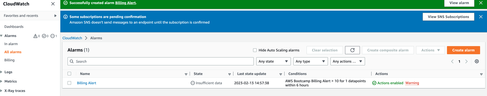
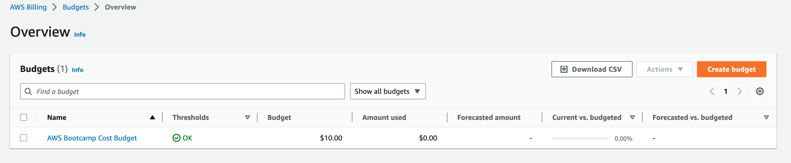
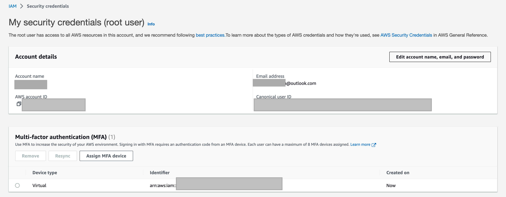
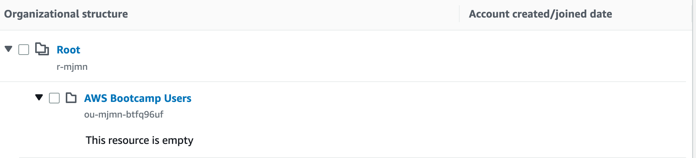
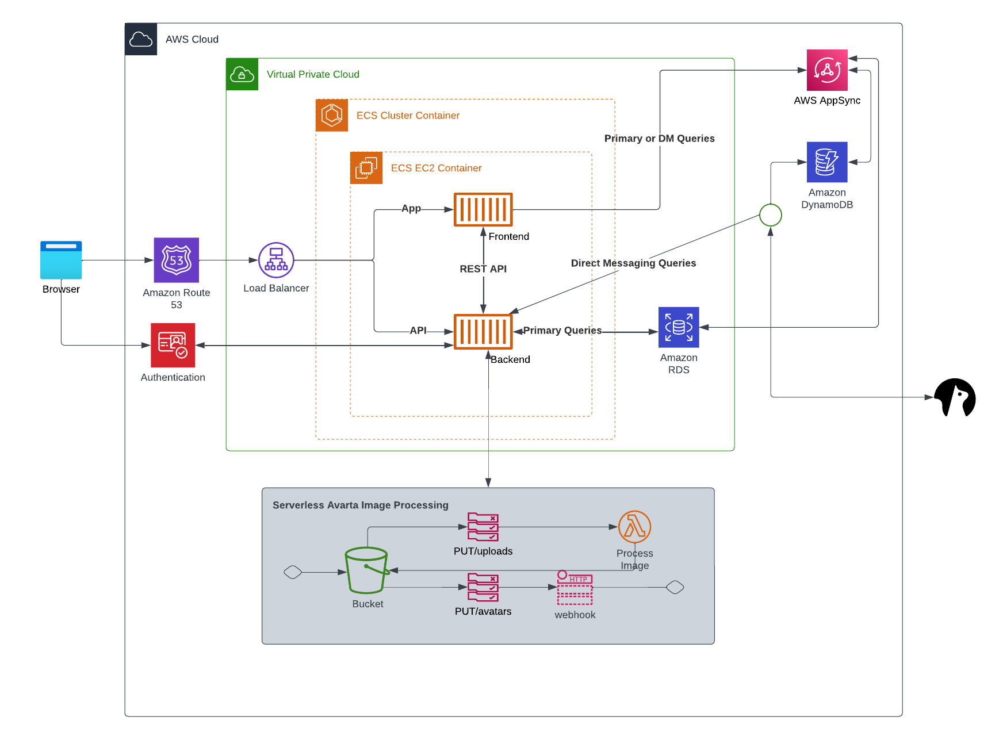

# Week 0 — Billing and Architecture

## Spend Considerations:

* AWS Bill Walkthrough
    * Make sure to select the right region.
    * Learn about AWS Free Tier.
    * Set up billing references.
    * Create billing alerts.
    
    * Set up a budget.
    
    * Learn about cost allocation tags.
    * Use Cost Explorer.
    * Take advantage of credits.
* Estimate Cost
* Use the AWS Pricing Calculator
* Learn more about AWS Free Tier

## AWS Cloud Security

What is Cloud Security, and why is it important for businesses in a cloud environment?
What is Cloud Security?

Why is Cloud Security important?

Why does Cloud Security require practice?

### Adding MFA for the Root User

* Where to enable MFA for the root account?
* How to add MFA for the root user.

## Creating an Organization Unit

#### Some Handy Tips for AWS Organizations

* Types of OUs.
* Management Account.
* Automating Vendor Accounts with Designated Owners for each AWS Account.
Creating an AWS Organization

Creating CloudTrail

### Creating IAM Users

#### Some Handy Tips for IAM Users

* Three kinds of users in AWS.
* Enable MFA for all human users.
* The principle of least privilege.
Creating AWS IAM Roles

#### Some Handy Tips for IAM Roles

* Two types of IAM roles & IAM policies.
* IAM Roles vs IAM Policies.
* The principle of least privilege.

### Create User Group

### Create AWS SCP Policies

## Recreate Diagram in Lucid Charts

[Link to Lucid Charts](https://lucid.app/lucidchart/9e6e0473-c7d7-42f4-b4cb-4dd67f4fd9b5/edit?invitationId=inv_16673061-8697-4ed2-9a42-69d59b2fb122)

## AWS CLI

The AWS CLI is a unified tool that allows you to interact with various AWS services from a command-line interface. It provides a simple and consistent way to manage your AWS resources, and it can be used on various platforms, including Windows, macOS, and Linux.

Tips: The `--cli-auto-prompt` option in the AWS CLI (Command Line Interface) allows we to interactively provide values for any missing required parameters when running commands.

When we run an AWS CLI command that requires input parameters, we can specify those parameters using the command line options or by providing a JSON file with the --cli-input-json option. However, if we don't provide all of the required parameters, the command will fail.

With the `--cli-auto-prompt` option, the AWS CLI will prompt you for any missing required parameters, so we can provide them interactively. This can be helpful when we're not sure what values to provide for the parameters or when we don't want to enter long command lines with multiple options.