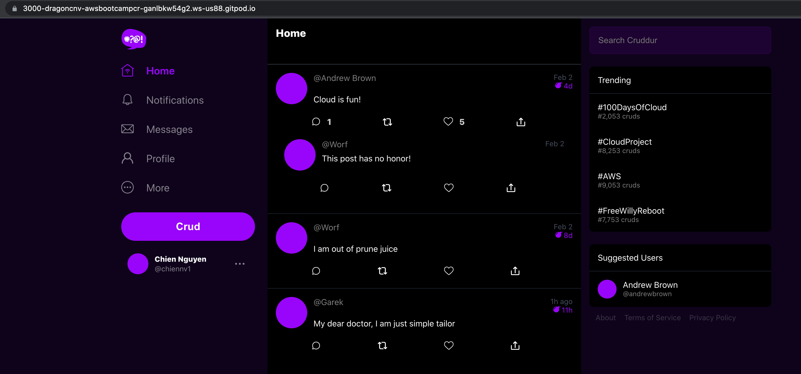
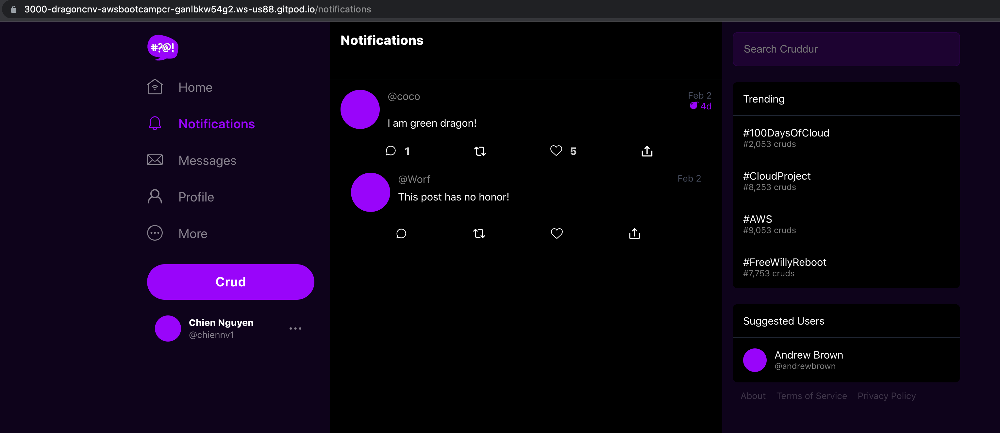

# Week 1 — App Containerization

## Introduction:
This document outlines the tasks for Week1 of the AWS Bootcamp 2023. The goal is to containerize an application and set up a local development environment.

## Tasks:

### Configure Gitpod.yml configuration
    - Add a task to install the AWS CLI extension
    - Add a task to install Postgres
    - Install VS Code extension vscode-openapi

### Clone and verify codebases locally
### Write and test Dockerfile for backend-flash and frontend
### Create a Docker Compose file for both backend and frontend
### Add a new notifications feature
- Define OpenApi endpoint in the backend
- Create a page and navigate in frontend with Nodejs

Results: 
      
    

### Install Dynamodb locally
    - Create a table with AWS CLI
    - Create an item in the table with AWS CLI
### Install and connect to Postgresql

References:

- [Week 1 guideline from Andrew Brown](https://github.com/omenking/aws-bootcamp-cruddur-2023/blob/week-1/journal/week1.md)
- [100DaysOfCloud from Andrew Brown](https://github.com/100DaysOfCloud/challenge-dynamodb-local)