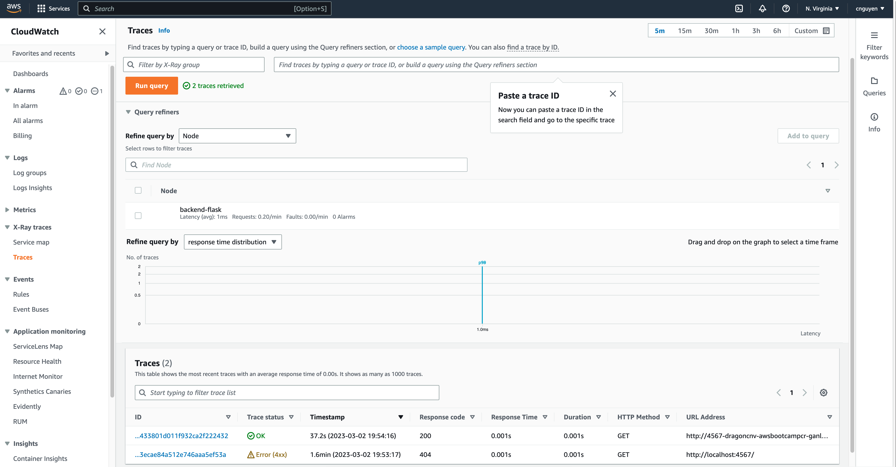
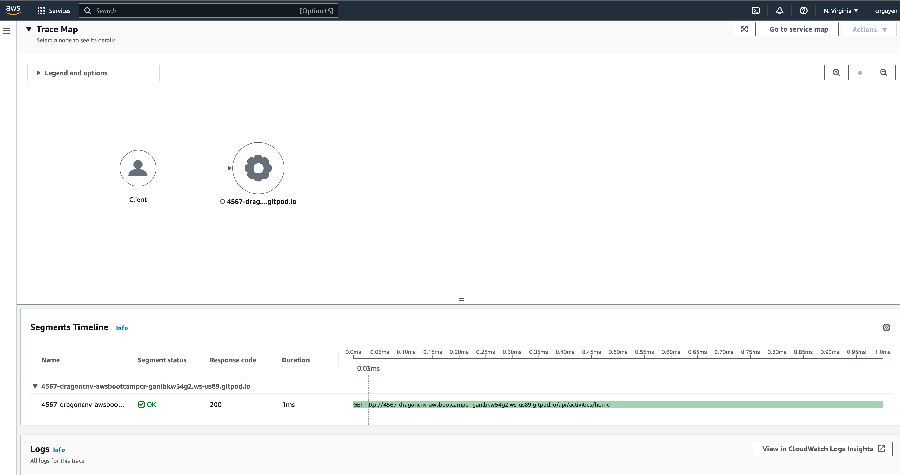
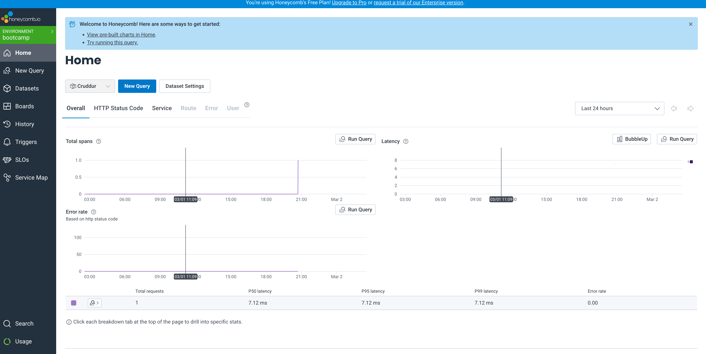
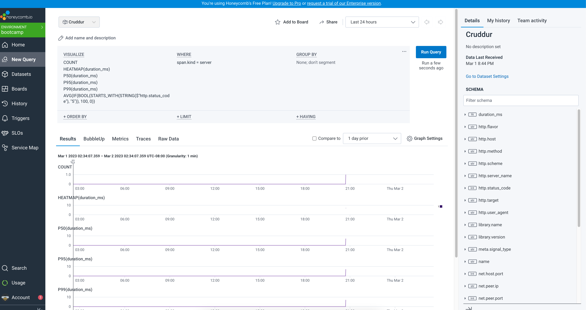
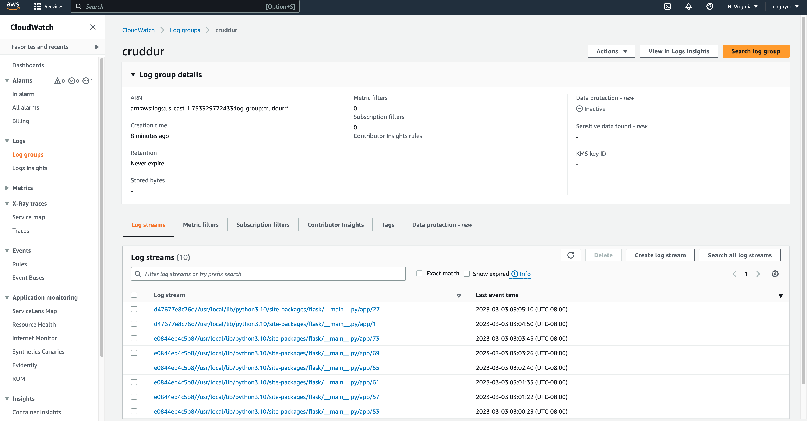
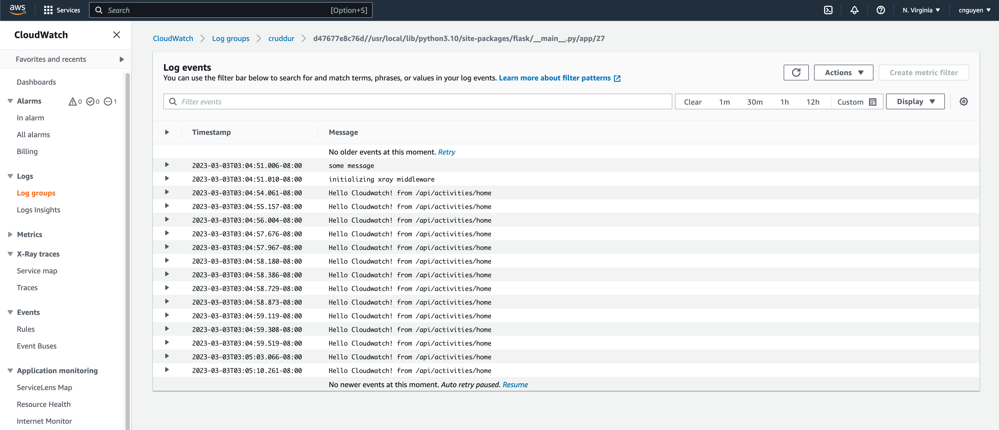
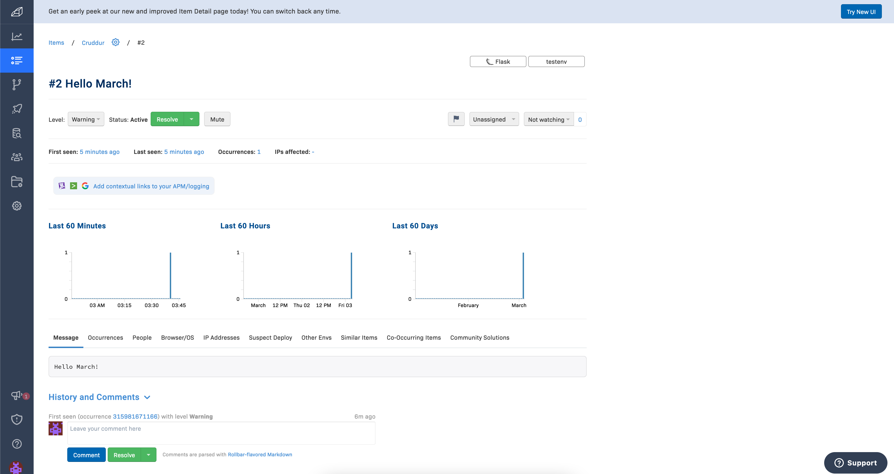
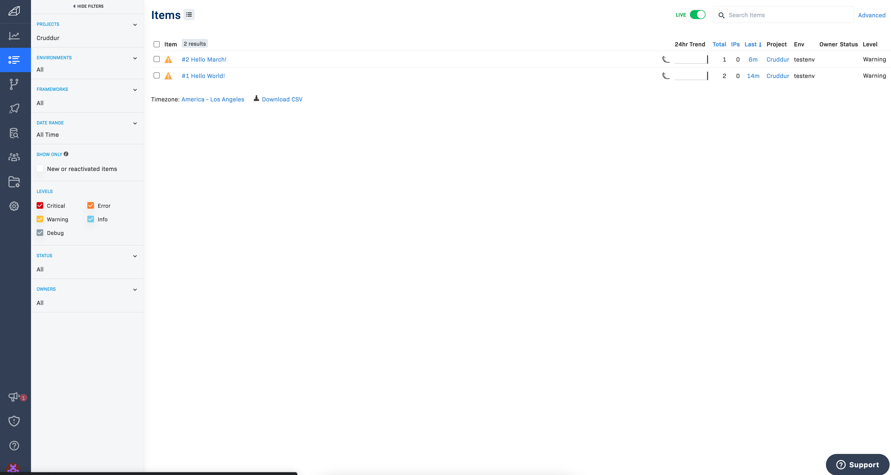

# Week 2 — Distributed Tracing

## Introduction:
This document outlines the tasks for Week 2 of the AWS Bootcamp 2023, which aims to set up monitoring tools for the application. I encountered an issue with environment settings, which was not always correct. However, it was great to learn how to troubleshoot the issue with Docker extensions and view logs from there.

## Tasks:

### X-Ray
Results:
  

### HoneyComb
Results:
  

### CloudWatch Logs
Results:
  

### Rollbar
Results:
  

References:

- [Week 2 guideline from Andrew Brown](https://github.com/omenking/aws-bootcamp-cruddur-2023/blob/week-2/journal/week2.md)